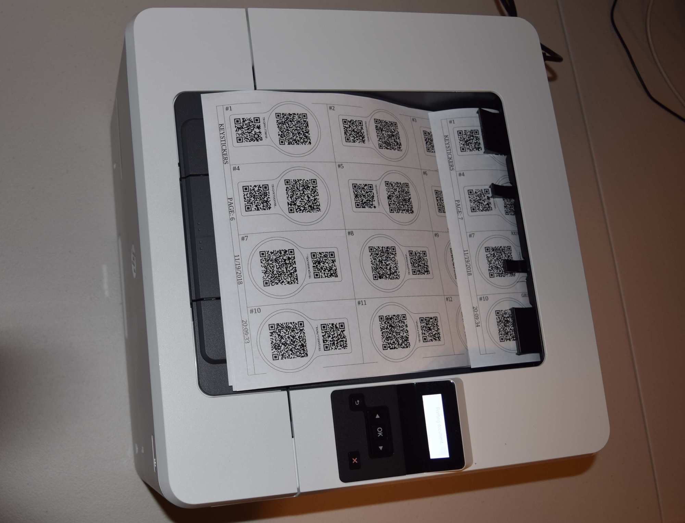
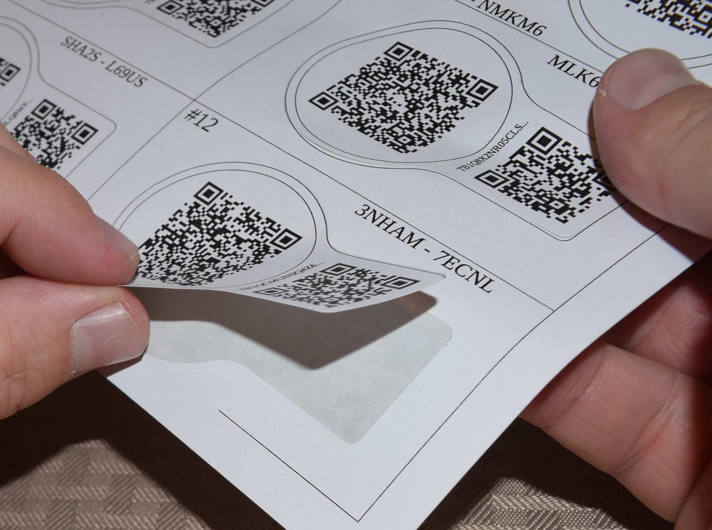
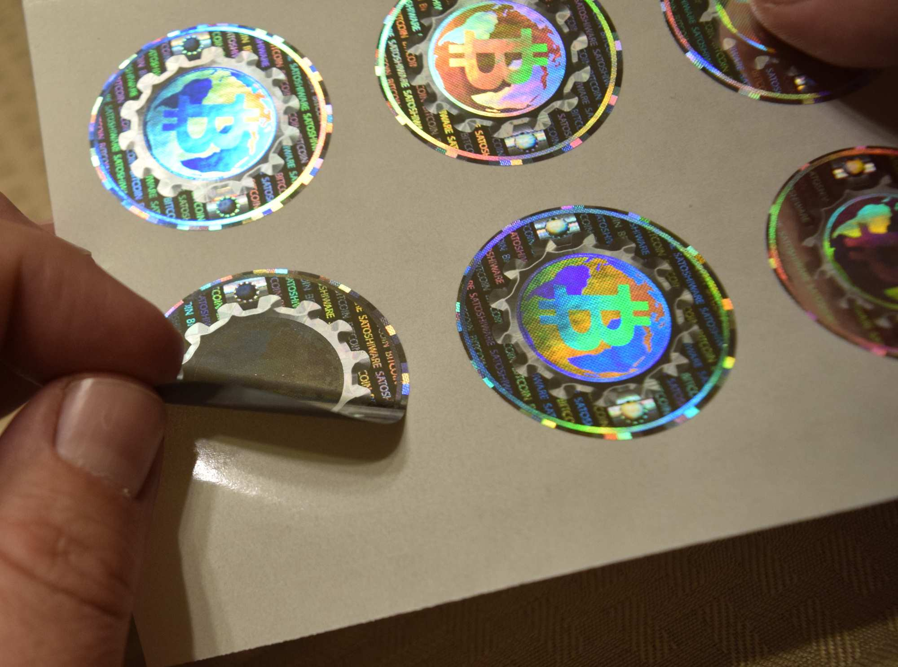
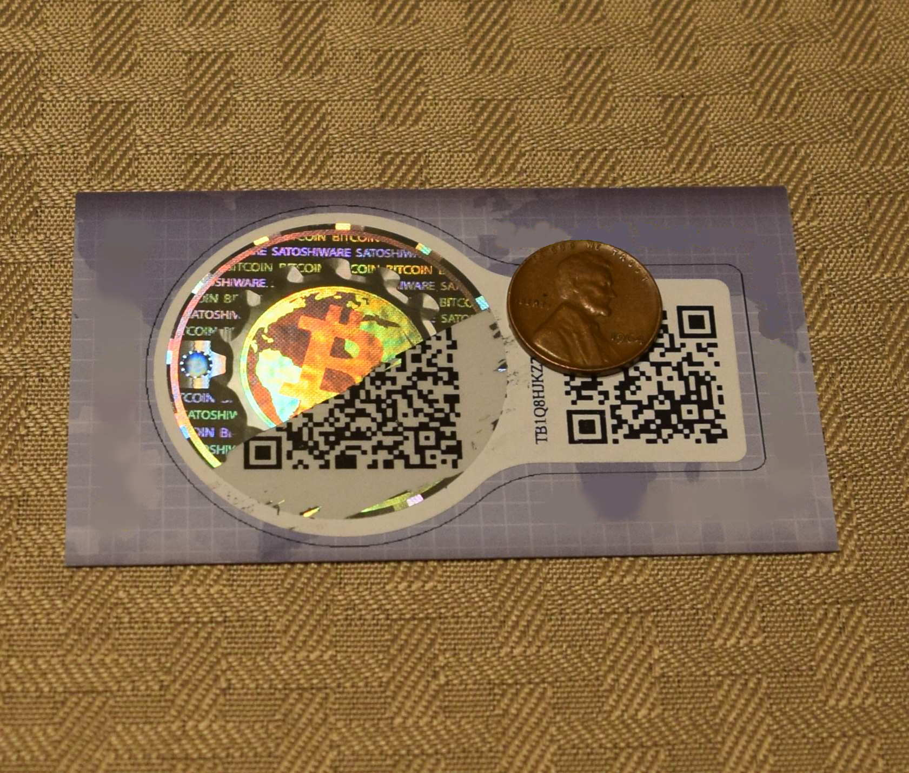
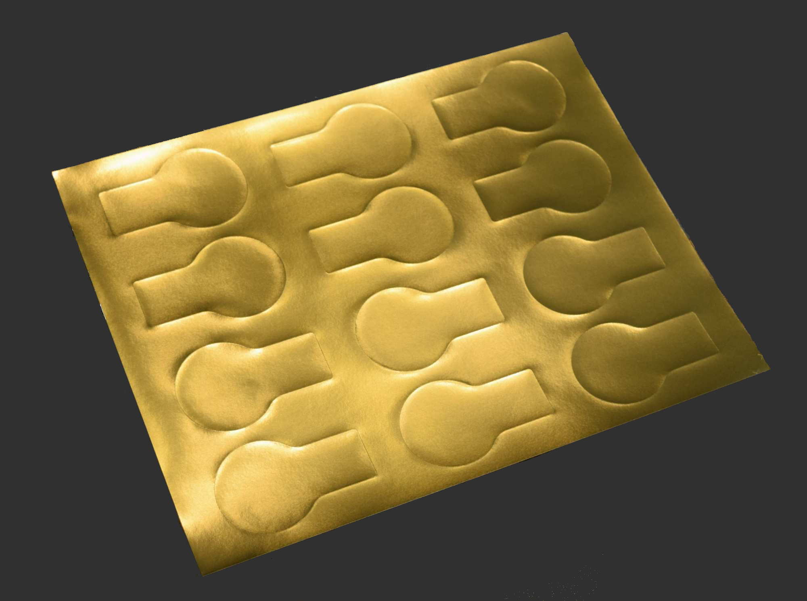

## Keystickers: Bitcoin Wallets that Stick
Keystickers are single use Bitcoin wallets that adhere to the back of your business cards. Once your sticker sheets are printed, the private keys are covered with security holographic scratch-off stickers.

The business cards must indicate the person who manufactured and applied the Keystickers. This individual is known as the “Local Satoshi”. He/She is local to the community, well-known, very competent, and highly trusted. With Keystickers, the “Trust Vector” is simplified and easily understood by the clients; they will know exactly where to go for all their Bitcoin needs. Keystickers are great tools to introduce Bitcoin security concepts, create positive first-time experiences, and ultimately, advance clients to the next level (hardware wallets).

Sticker sheets can be ordered from [Online Labels](https://www.onlinelabels.com/products/ol4143GF) (Gold: [OL4143GF](https://www.onlinelabels.com/products/ol4143GF), White: [OL4143WX](https://www.onlinelabels.com/products/ol4143WX))

Security holographic scratch-off stickers can be purchased from [Integraf](https://www.integraf.com/) (Product#: 7931-SC)  
Note: Production setup is over 1K USD. Last quote for 10,000 scratch-off stickers (6/1/2020) was around 1.65K USD (2.65K Total).

This open source software was created to facilitate the production of Keystickers (and [Satoshi Coins](https://github.com/Satoshiware/Satoshi-Coins)). This software is offered “as-is”, without warranty, and disclaiming liability for any damage resulting from its use. The manufacturer of the stickers

 

 

For a more professional appeal and better security, use the GOLD stickers. Light is impenetrable from underneath!

## Specifications
The security holographic scratch-off stickers are 40.6 mm in diameter and 30 um thick. They have a tough plastic film that protects and separates the private key from the scratch surface. The [PDF specification](specs/Holographic.pdf) for Satoshiware's security holographic scratch-off stickers is part of this repository as well as a [video](media/video.mp4) of the master proof.

The Keysticker sheets are 8 1/2" x 11" and will fit any standard printer. The technical drawing is available within this repository ([PDF](specs/Keystickers.dwg.pdf) or [DWG](specs/Keystickers.dwg)). A simple wired monochrome laser printer (e.g. HP LaserJet Pro M402n) is highly recommended for the job. These sheets are thicker compared to standard paper (especially the gold sheets); adjust the printer accordingly to avoid the toner from flaking off. Also, minimize the toner thickness as much as possible; otherwise, the private key may be slightly discernible underneath the scratch-off sticker. Note: The Keysticker software can control the private key grayscale color to further mitigate this problem; just make sure the QR is still easily scannable.

## Running
After downloading and extracting the latest release, extract the contents of the file “RunKeystickers-$REV.(zip|tar.gz)”. From the shell (or command prompt), move to the appropriate directory and execute “java -jar keystickers-$REV.jar -k”

If running on a Raspberry Pi with a hardware RNG (RPi 3 B+ or later), the software will try to read from /dev/hwrng for additional entropy. Make sure the RNG is set with the appropriate read access privileges.

Note: [OpenJDK](http://openjdk.java.net/) is the open source version of Java. Open source software promotes innovation and security while discouraging foul play. See [AdoptOpenJDK.net](https://adoptopenjdk.net/) for install instructions.

## External Dependencies
External libraries are not compiled into the main program. Use the "-v" switch, instead of "-k", at run time to calculate and cross-check their SHA256 checksums. This will ensure they have not been compromised.

## Compiling
Keystickers is compiled with Maven. Visit [Maven's web site](https://maven.apache.org/) for additional information on downloading, installing, and running their software project management tool.

## Development
[IntelliJ IDEA Community](https://www.jetbrains.com/idea/) was used for the development of this project. GUI specific changes will most likely require this IDE for successful modifications.

**Getting started with IntelliJ**

* File -> Open
    * Find and select the Keysticker's project from its root directory
    * Intellij will recognize maven and will adjust its settings accordingly
 
* File -> Project Structure -> Project Settings -> Project
    * Select the appropriate "Project SDK"
    * Set "Project language level" to 8
    * Configure "Project compiler output" Path (e.g. "Keysticker Project Directory"\out)

* Project Structure -> Project Settings -> Modules -> Sources
    * Set "Language level" to 8

* Project Structure -> Project Settings -> Modules -> Paths
    * Configure "Output path" (e.g. "Keysticker Project Directory"\out\production)
    * Configure "Test output path" (e.g. "Keysticker Project Directory"\out\test)

* Create Run configuration for Main.main()
    * In the "Project" explorer, find the "Main" Java Class (src\main\java\org\satoshiware\keystickers\Main.java)
    * Right click on the Java Class and click "Create 'Main.main()'..."
    * Add the desired "Program arguments:" (“-v”, “-k”, “-s”, or “-t”)
    * Note: The external libraries must be added to the "Keysticker Project Directory"\lib in order for verifications ("-v") to work from within the IntelliJ IDE.

## Secure Setup
If there are wireless features (WIFI, Bluetooth, etc.) in your setup, disabled them; hardware that cannot reliably turn off wireless connectivity should not be used. Use only wired components and don't forget to disconnect that wired LAN!

Once the print jobs are complete, the entire setup becomes a liability. All residue of any private key must be obliterated: Write random data before formatting and then flush out the printer with a few dummy print jobs. If there are still doubts that the printer may be storing sensitive data then destroy its main PCB.
